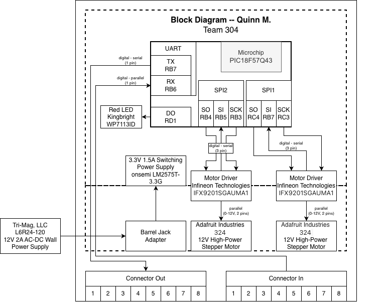

## Overview
The purpose of this block diagram is to show the major functions and components of the dual-motor subsystem in a simple way. 
The block diagram includes all components mentioned in [*section 3*](https://qmaness-hue.github.io/EGR314qmaness.github.io/03-Component-Selection/Component-Selection/), as well as the microcontoller selected in [*section 4*](https://qmaness-hue.github.io/EGR314qmaness.github.io/04-Microcontroller-Selection/Microcontroller-Selection/). The UART TX (transmitter) and RX (reciever) are the communications ports, which are to be used between subsystems for them to transmit data.
[*here*](SchematicREVISION2.pdf)

## Block Diagram 

