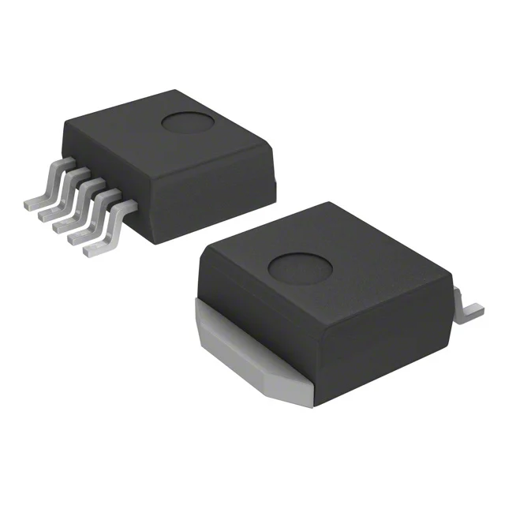
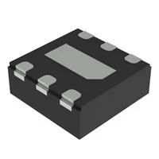
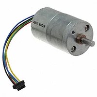
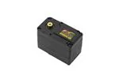
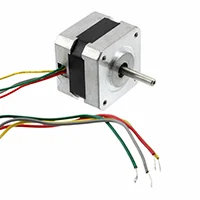
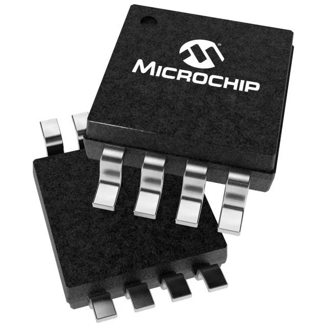
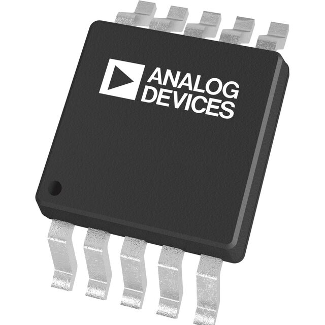
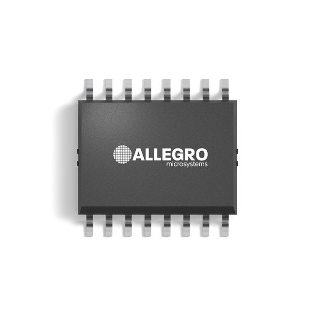
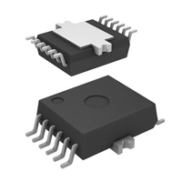
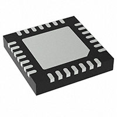

## Module's Selected Major Components

The following sections are the selected major components necessary for the motor system that will turn the EV Scope so as to properly track celestial/distant objects.

### Power Management
*Table 1: Voltage Regulator*

**Voltage Regulator**

| **Component**                                                                                                                                                                                      | **Pros**                                                                                                                                    | **Cons**                                                                                            |
| ------------------------------------------------------------------------------------------------------------------------------------------------------------------------------------------------- | ------------------------------------------------------------------------------------------------------------------------------------------- | --------------------------------------------------------------------------------------------------- |
|   LM2575 Regulator $2.16/each [link to product](https://www.digikey.com/en/products/detail/onsemi/LM2575D2T-3-3R4G/1476688)                 | \* Inexpensive \* Provided by course \* Can meet surface mount constraint of project \*Simple \* Already have/know how to use | \*Would be awkward to surface mount to a PCB |
|   AP7583Q-33FDZW-7 Regulator $0.80/each [link to product](https://www.digikey.com/en/products/detail/diodes-incorporated/AP7583Q-33FDZW-7/17736614)                 | \* Cheap \* Surface Mount \* 3.3V-5V \*Simple                                               | \* Cheap \* Don't already have |

**Rationale:** Seeing as we already have the LM2575, and it appears to be adequate for this project, it's as good a choice as any.

### Actuators

*Table 2: Gearmotor Table*

**Gearmotor**

| **Component**                                                                                                                                                                                      | **Pros**                                                                                                                                    | **Cons**                                                                                            |
| ------------------------------------------------------------------------------------------------------------------------------------------------------------------------------------------------- | ------------------------------------------------------------------------------------------------------------------------------------------- | --------------------------------------------------------------------------------------------------- |
|   FIT0441 Gearmotor $19.90/each [link to product](https://www.digikey.com/en/products/detail/dfrobot/FIT0441/6588579)                 | \* Simple [^1] \* Brushless \*Powerful                                                | \* May not have accuracy required \* Incremental |
|   SER0070 Servo Motor  $24.88/each [link to product](https://www.mouser.com/ProductDetail/DFRobot/SER0070?qs=6avfeC6zeS5mmJI6Z%252BxOKw%3D%3D)                 | \* Brushless \* Servo Motor  \* Accurate and powerful                                               | \* Relatively Expensive \* No datasheet |
|   324 Stepper Motor  $14.00/each [link to product](https://www.digikey.com/en/products/detail/adafruit-industries-llc/324/5022791)                 | \* Simple  \* 200 Steps per revolution (accurate) \* Inexpensive                                               | \* Not super accurate  \* Not super powerful |

**Rationale:** The 324 Stepper motor is simple while maintaining high torque and easily optimized accuracy.

*Table 3: Motor Driver Table*

**Motor Driver**

| **Component**                                                                                                                                                                                      | **Pros**                                                                                                                                    | **Cons**                                                                                            |
| ------------------------------------------------------------------------------------------------------------------------------------------------------------------------------------------------- | ------------------------------------------------------------------------------------------------------------------------------------------- | --------------------------------------------------------------------------------------------------- |
|   TC647BEOATR Surface Mount Driver $1.64/each [link to product](https://www.digikey.com/en/products/detail/microchip-technology/TC647BEOATR/562490)                 | \* Brushless \* Meets surface mount constraint of project  \* Inexpensive                                               | \* Made specifically for fans \* Needs parallel interface. |
|   MAX6650EUB+T Surface Mount Driver $8.82/each [link to product](https://www.digikey.com/en/products/detail/analog-devices-inc-maxim-integrated/MAX6650EUB-T/1521889)                 | \* Brushless \* Can cover multiple parallel motors  \* Uses I2C Interface                                               | \* Relatively Expensive \* Utilizes tachometer (could be difficult to make small adjustments with). |
|   A3946KLPTR-T Surface Mount Driver $3.42/each [link to product](https://www.digikey.com/en/products/detail/allegro-microsystems/A3946KLPTR-T/1006258)                 | \* High voltage option  \* Brushless \* Overheat protections  \* Uses MOSFET                                               | \* More complex \* Utilizes higher voltage  \* Not compatible with stepper motor |
|   IFX9201SGAUMA1 Surface Mount Driver $3.55/each [link to product](https://www.digikey.com/en/products/detail/infineon-technologies/IFX9201SGAUMA1/5415542)                 | \* Works with PIC  \* Works with stepper motor  \* Uses SPI or PWM  \* We already have it                                               | \* Difficult to use with MPLAB  \* DOES NOT WORK WITH BOTH PIC AND MOTOR SIMULTANEOUSLY |
|   TMC2209 Surface Mount Driver $5.20/each [link to product](https://www.digikey.com/en/products/detail/analog-devices-inc-maxim-integrated/TMC2209-LA-T/10232491)                 | \* Works with PIC  \* Works with stepper motor  \* Uses UART and simple GPIO connections  \* Compatible, simultaneously, with chosen PIC and Motor | \* More complex device than others |

**Rationale:** The TMC2209 is simultaneously compatible with the selected motor, and the PIC; it offers ease of adjustment, and uses only GPIO pins unless the user wants to program it with UART (uneccessary).
