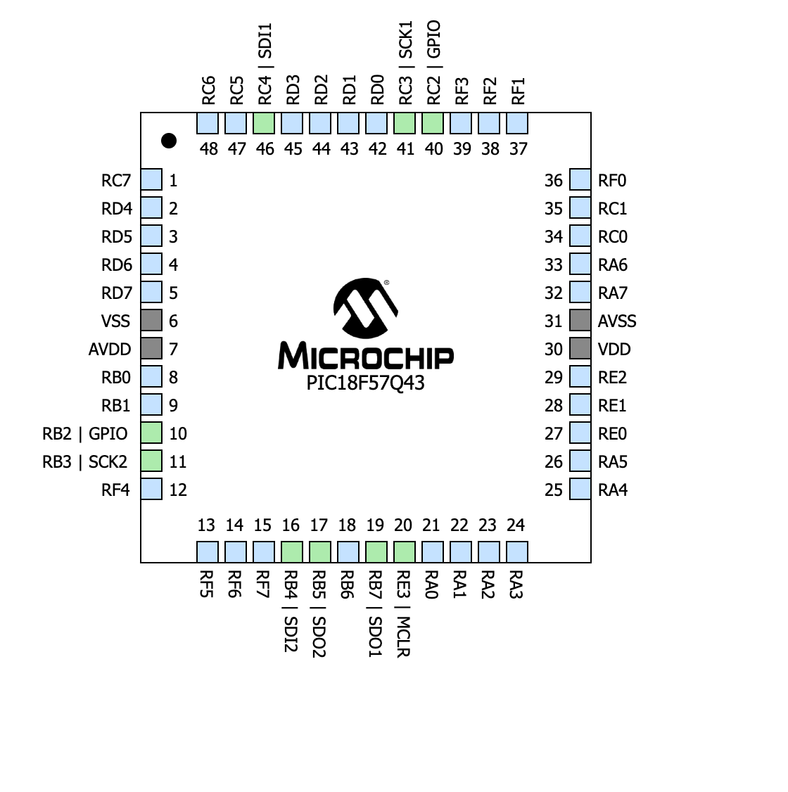
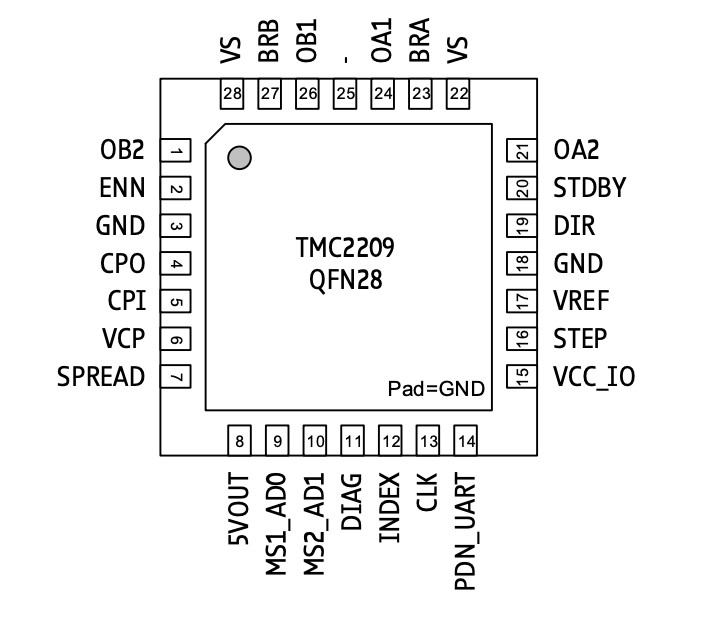

## Intro

The following section contains information regarding the selected microcontroller necessary for the motor system that will turn the EV Scope so as to properly track celestial/distant objects.

**Role and Responsibilities**

The role of this subsystem of the EV Scope is to accurately recieve instruction from the human interface, and then interpret that information and make movements to accomplish the given need. The motor needs to accurately move in the manner that the user wishes--meaning that the motor has to accurately interpret data from the human interface, and subsequently make precise movement to accomplish the given task.

## Selected Microcontroller

The microcontroller I selected for the motor system is the surface mount version of the PIC18F57Q43, a microcontroller provided in class. The motor driver and gearmotor I selected are compatible with the PIC18F57Q43. The motor driver I selected--the TMC2209--utilizes the GPIO and UART (uneccessary) interface. The UART with MPLAB interface is covered in depth during class, making it a well understood software. All parameters appear to match up, as I did the component selection with the microcontroller given in class in mind.

**MPLAB Pin Configuration**

The selected motor driver (TMC2209) is compatible with the selected PIC18F57Q43 microcontroller. In the figure above, you can see all allocations needed for communications between the drivers, LEDs, and the debugging button with the PIC.

## Driver-Microcontoller Communications
**Pinout for TMC2209**

**Pinout for Driver 1**

| **Pin**                                                   | **Pin Function**                                                                                         | **Connection**                                                                                                       |
| -------------------------- | -------------------------------------------------------- | ------------------------------------------------------- |
| Pin 1 (OB2) | Motor Coil B Output 2 | Motor |
| Pin 2 (VSO) | Supply for SO Output | Voltage Regulator |
| Pin 3 (SO) | SPI Serial Output | RC4 / SDI1 |
| Pin 4 (VS) | Voltage Supply | Voltage Regulator |
| Pin 5 (OUT1) | Output 1 | Motor |
| Pin 6 (GND) | Ground | Ground |
| Pin 7 (OUT2) | Output 2 | Not Connected |
| Pin 8 (SI) | Serial Input | RB1 / SDO1 |
| Pin 9 (CSN) | SPI Chip Select | Not Connected |
| Pin 10 (SCK) | Clock Input | RC3 / SCK1 |
| Pin 11 (DIS) | Disables outputs | Not Connected |
| Pin 12 (PWM) | Pulse Width Modulation | Not Connected |

**Pinout for Driver 2**

| **Pin** | **Pin Function** | **Connection** |
|-----|-------------|------------|
| Pin 1 (DIR) | Defines direction of motor current | PIC GPIO RB2 |
| Pin 2 (VSO) | Supply for SO Output | Voltage Regulator |
| Pin 3 (SO) | SPI Serial Output | RB4 / SDI2 |
| Pin 4 (VS) | Voltage Supply | Voltage Regulator |
| Pin 5 (OUT1) | Output 1 | Motor 2 |
| Pin 6 (GND) | Ground | Ground |
| Pin 7 (OUT2) | Output 2 | Not Connected |
| Pin 8 (SI) | Serial Input | RB5 / SDO2 |
| Pin 9 (CSN) | SPI Chip Select | Not Connected |
| Pin 10 (SCK) | Clock Input | RB3 / SCK2 |
| Pin 11 (DIS) | Disables outputs | Not Connected |
| Pin 12 (PWM) | Pulse Width Modulation | Not Connected |
