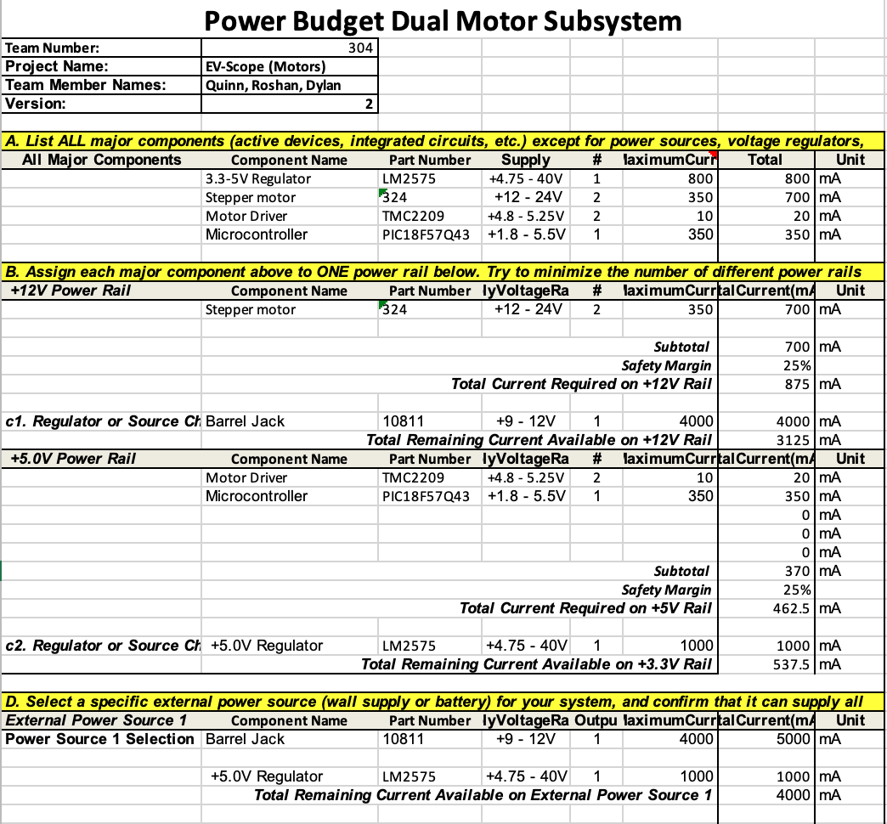

## Power Budget Spreadsheet ##

**Figure 1**: Power budget for the dual-motor subsystem.

## Power Budget Explanation ##
The power budget in [Figure 1](PowerBudget2.pdf) shows, through reference to the datasheets of the components involved, how the power will be split between the different components. The spreadsheet proves that the necessary circuitry is possible, giving validity to the schematic and PCB. The motors will be connected to the +9 volt barrel jack. The rest of the components will be connected to the +5 volt regulated voltage.

[This](PowerBudget2_QM.xlsx) is the xlsx file of the power budget.

[This](PowerBudget2.pdf) is the PDF file of the power budget.

[This](PowerBudget_2_314.zip) is the zip file containing all of the above files.
