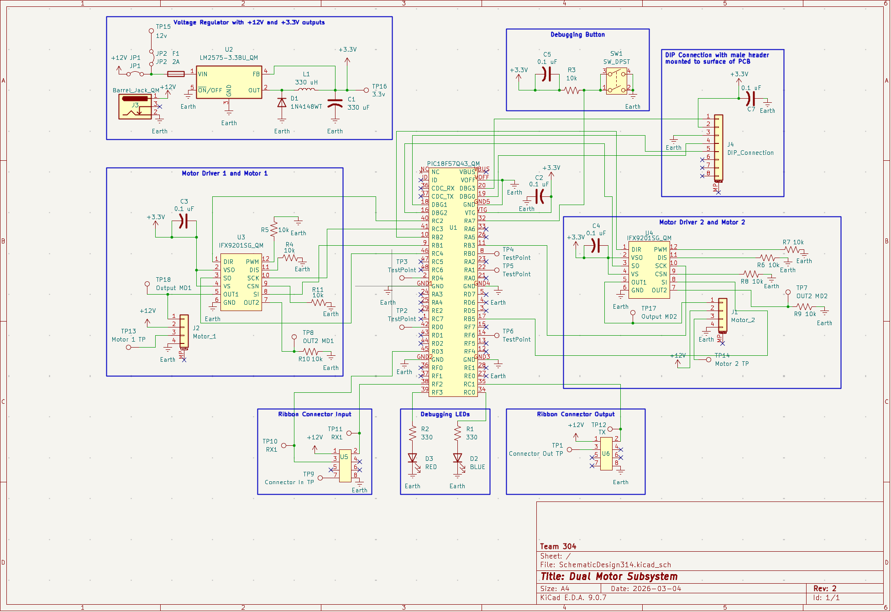

## Overview

This schematic is designed to support a dual motor system driven by two separate motor drivers controlled by the PIC18F57Q43 microcontroller. All components are powered by a voltage regulator that converts 8-12 volts into 5.0 volts. The microcontoller of this system has UART connections that go to the other subsystems' microcontollers.

{style width:"350" height:"300;"}
**Figure 1:** Schematic of Dual Motor Subsystem

## Resources

The schematic as a PDF download is available [*here*](Schematic2.pdf), and the Zip folder of the project [*here*](SchematicDesign2_314.zip).
