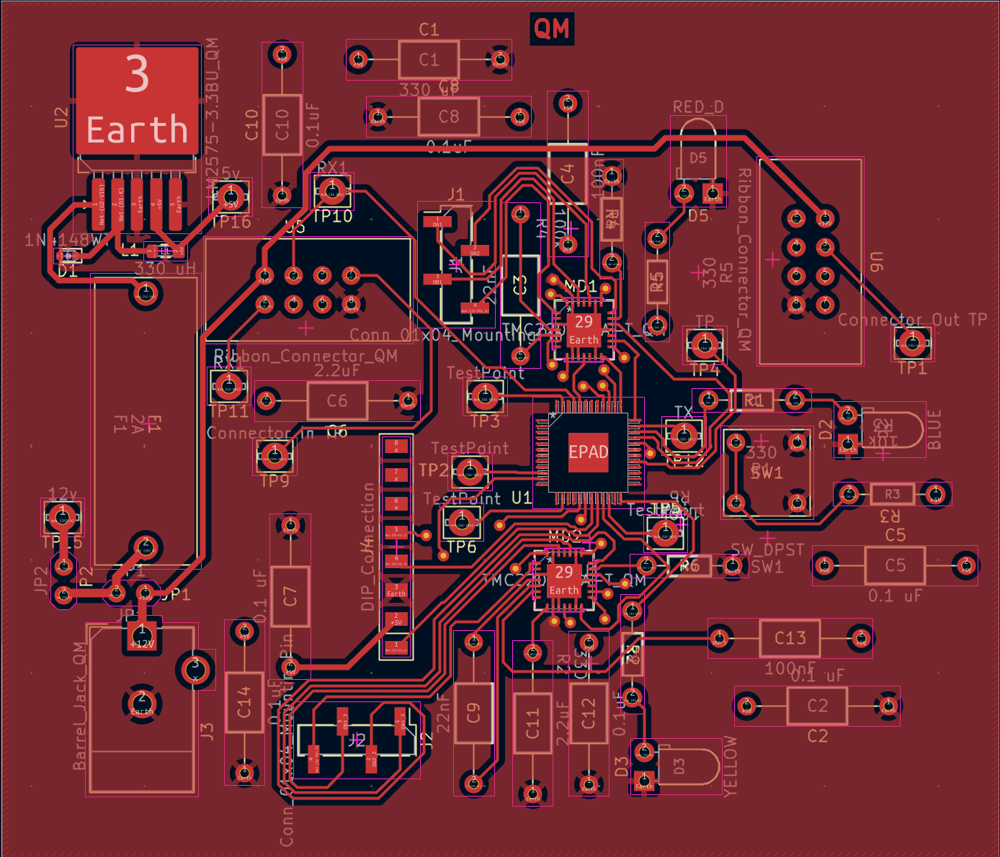
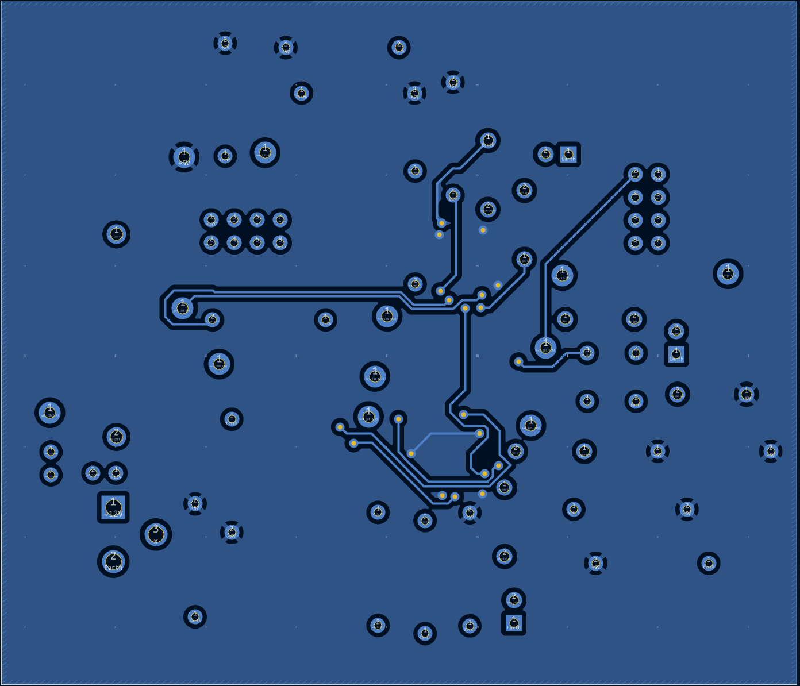
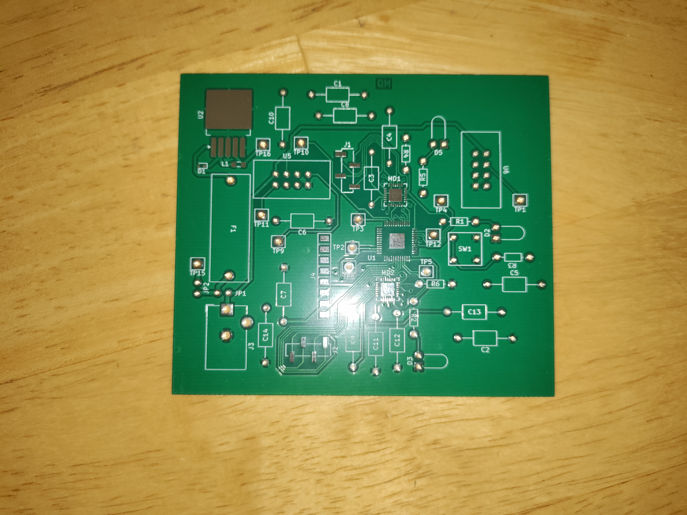

## Overview

Below are the main PCB, front copper plate, and the back plate of the PCB design for the dual motor subsystem of the EV-Scope. [Figure 1](PCB_front.pdf) is the PCB. [Figure 4](PCBphoto.pdf) is a photo of the populated PCB as it was manufactured. Below the figures are resources such as the PDF versions of the figures, as well as the zip files for the Gerber files of the PCB and the overall subsystem.

## ECAD PCB
**Figure 1:** The subsystem PCB.
{style width:"350" height:"300;"}

**Figure 2:** The front layer only.
{style width:"350" height:"300;"}

**Figure 3:** The back layer only.
{style width:"350" height:"300;"}

## Final PCB
**Figure 4:** The manufactured, populated, PCB.

**Figure 5:** The manufactured, unpopulated, PCB.

## Resources

The PCB as a PDF download is available [*here*](PCB_front.pdf).

The PCB front layer as a PDF download is available [*here*](PCBfront.pdf).

The PCB back layer as a PDF download is available [*here*](PCBback.pdf)

The populated PCB as a PDF download is available [*here*](PCBphoto.pdf).

The unpopulated PCB as a PDF download is available [*here*](PCBfoto.pdf).

The Zip file of the project [*here*](SchematicDesign2_314.zip).

The Zip file containing the Gerber Files of the PCB [*here*](GerberQM.zip).
