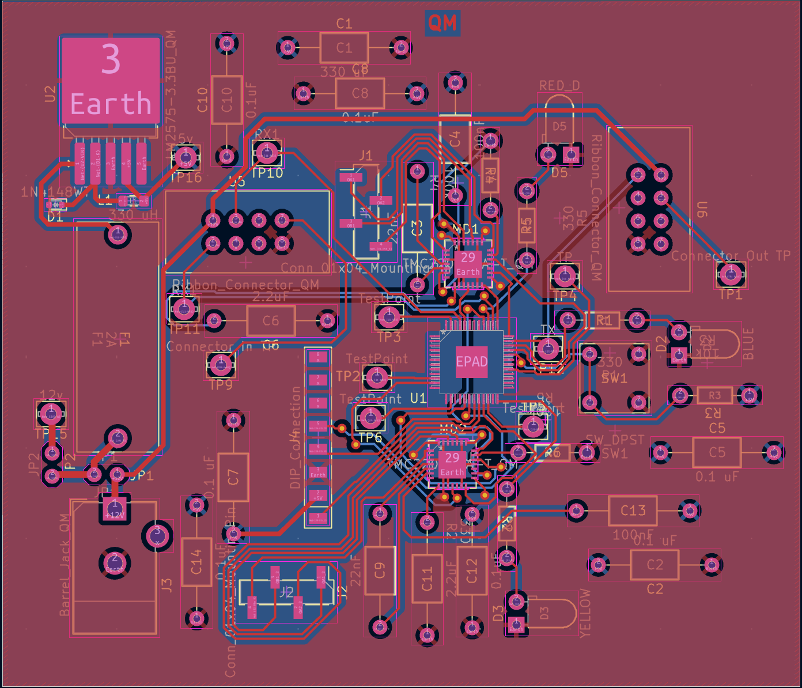
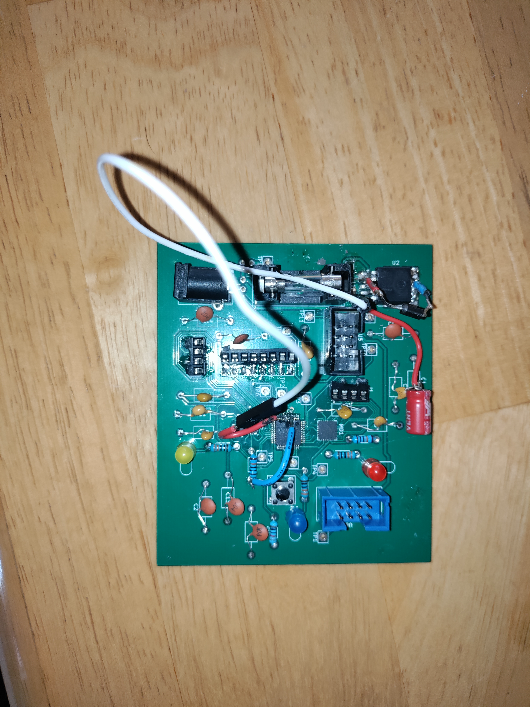

## Overview

Below are the main PCB, front copper plate, and the back plate of the PCB design for the dual motor subsystem of the EV-Scope. [Figure 1](PCB_front.pdf) is the PCB. [Figure 2](PCBphoto.pdf) is a photo of the populated PCB as it was manufactured. Below the figures are resources such as the PDF versions of the figures, as well as the zip files for the Gerber files of the PCB and the overall subsystem.

## ECAD PCB
**Figure 1:** The subsystem PCB.
{style width:"350" height:"300;"}

## Final Populated PCB
**Figure 4:** The manufactured, populated, PCB.

## Resources

The PCB as a PDF download is available [*here*](PCB_front.pdf).

The manufactured PCB as a PDF download is available [*here*](PCBphoto.pdf).

The Zip file of the project [*here*](SchematicDesign2_314.zip).

The Zip file containing the Gerber Files of the PCB [*here*](GerberQM.zip).
