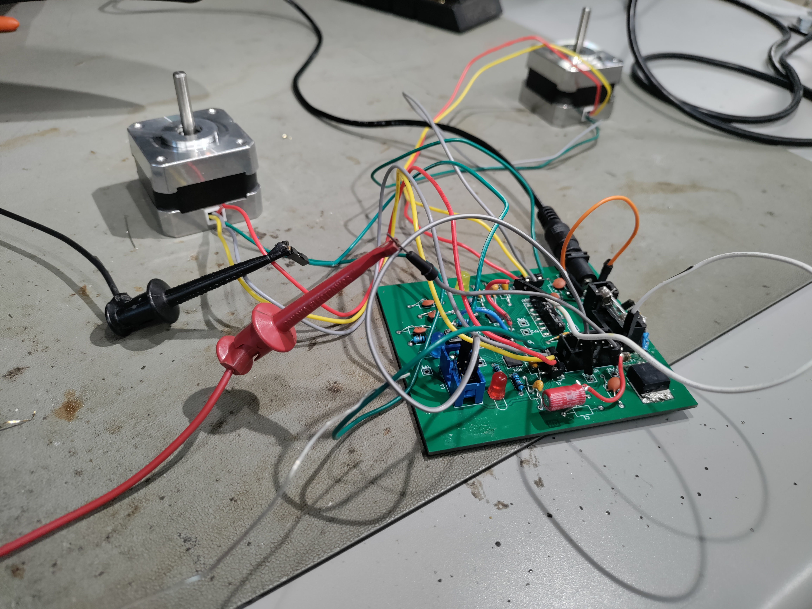
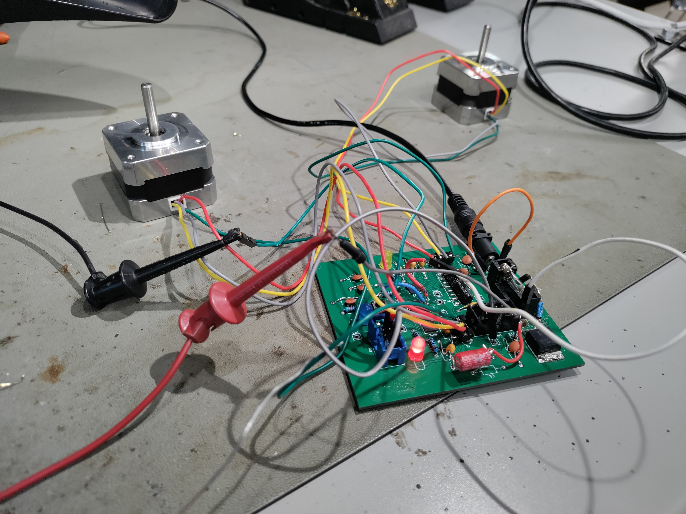
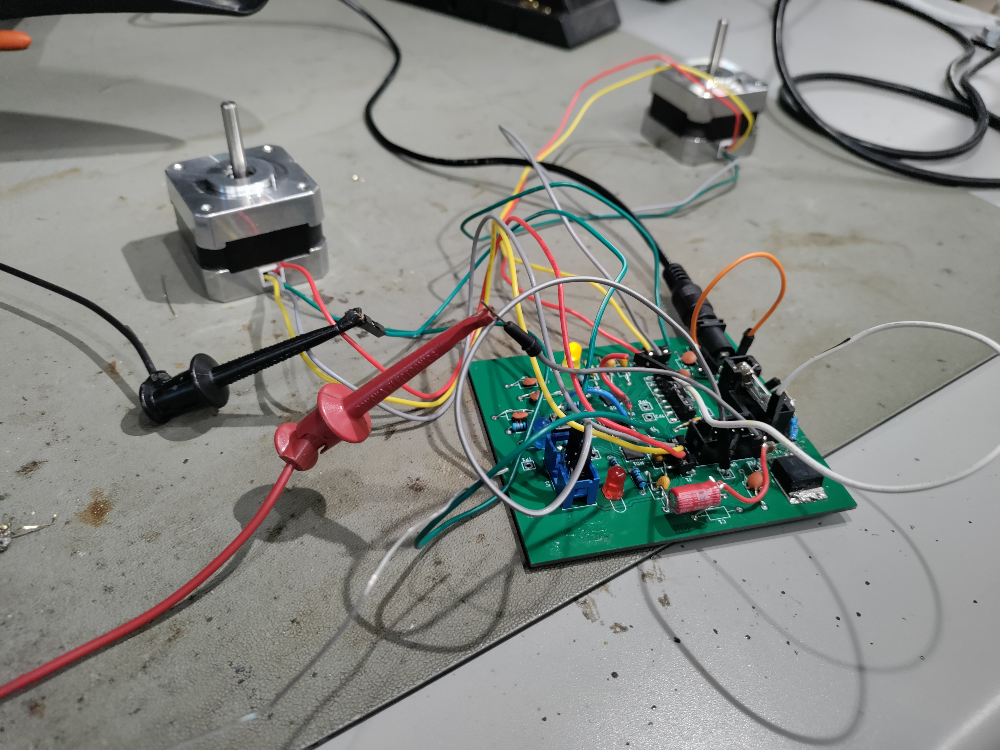

## Software
I used MPLABX v6.25 for the coding and top design. The project as a zip file is [*here*](Subsystem314.zip).

## Photos of 'Functioning' System
Though the motor system only worked for about a minute due to the motor drivers breaking over that time, I still have photos of microcontroller working as intended. 
The yellow LED blinks as a timer/status LED. The red LED turned on to indicate that the controller was attempting to make the motors go in the forward direction.

